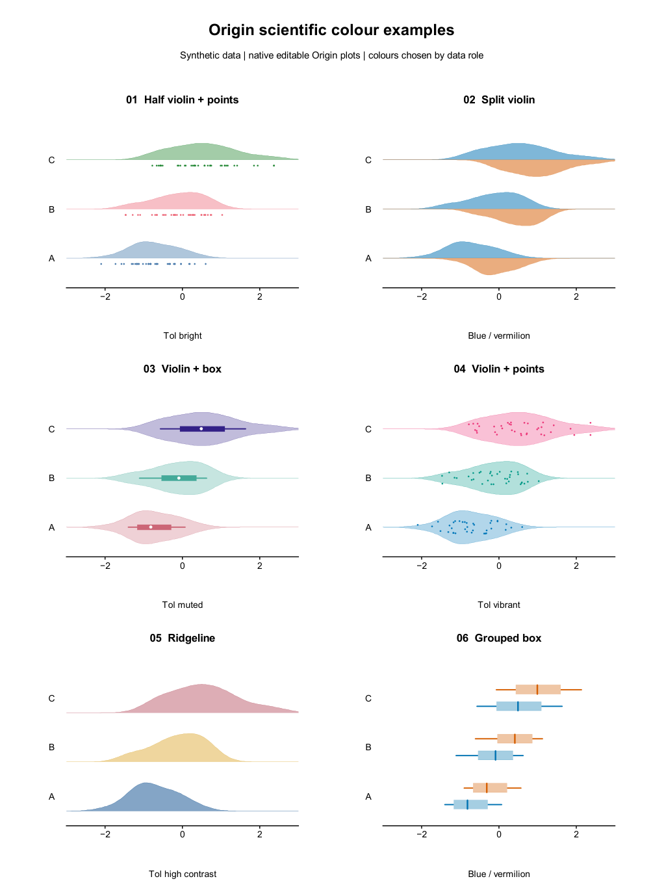

# Origin 气象水文科研绘图技能 · 40套配色与30篇文献

整理日期：2026-10-02。技能入口为[python-origin-plotting/SKILL.md](python-origin-plotting/SKILL.md)。保留 2026-09-30 的文献增强内容，合入本机最新的科研配色、原生 Origin 示例与参考册。

## 2026-10-02 更新

- **40 套离线色表**：保留原 25 套，增加 9 套 Scientific Colour Maps 和 6 套 Paul Tol 类别配色，含 RGB/HEX CSV、JASC PAL、原始色值、来源与 SHA256。
- **12 类原生合成示例**：[可编辑 OPJU](python-origin-plotting/assets/scientific_color_reference/origin_scientific_colors.opju) 与 [Origin 图型索引](python-origin-plotting/references/origin-gallery-recipes.md)。
- **四页科研配色参考册**：[PDF](python-origin-plotting/assets/scientific_color_reference/Origin_scientific_color_reference.pdf)。前两页来自原生 Origin，后两页为 ReportLab 矢量配色与 colorbar 说明。
- [科研配色与 colorbar 配方](python-origin-plotting/references/scientific-color-recipes.md)、重建脚本及 40 套色表检查工具。



## 保留的文献增强内容

本轮基于30篇新增期刊论文的方法、结果图与图注进行定向阅读；逐条记录论文观察、Origin应用建议与使用限制，不宣称完成论文复现或系统综述。文献来自HESS、GMD、BAMS、ESD、NHESS和NPG，覆盖2004—2026年；原技能已有的两篇色彩论文不计入30篇。

- 原12类基础图型加12类期刊诊断配方，覆盖技能ECDF、配对改进、portrait矩阵、概率校准、集合诊断、复合事件、干旱传播、圆形季节性、小波与故事线。
- [30篇文献证据索引](python-origin-plotting/references/literature-30.md)，含JSON及BibTeX。
- [Origin图型配方](python-origin-plotting/references/journal-figure-recipes.md)和[图件审查](python-origin-plotting/references/figure-review.md)。
- [四类只读表格检查与合成输入](python-origin-plotting/references/data-contracts.md)：可靠度、FDC、lag合成、技能矩阵。
- 保留既有Origin点区间模板、原12面板Matplotlib教学图库、排障经验及第三方许可。

## 安装与使用

将完整`python-origin-plotting`目录复制到目标工具的skills目录；不要只复制SKILL.md。更新已有技能时先保留其副本，合并本地自定义修改。

Python输入检查沿用NumPy和pandas。原生绘图另需可用的Origin/OriginPro及`originpro`；现有Matplotlib示例图库与原生Origin工程有独立标识。

直接查看 PDF/PNG 或使用 CSV/PAL 无需运行 Python。重建 12 类原生配色示例另需 SciPy；参考册后两页需 ReportLab，合并与字体检查需 PyMuPDF、fontTools 和脚本指定的 Windows Arial 字体。使用已有环境，依赖不会自动安装。

```powershell
cd python-origin-plotting
python -B -m unittest discover -s scripts -p "test_*.py"
python scripts/check_plot_table.py --kind reliability --csv assets/journal_examples/reliability.csv
python scripts/check_color_assets.py --out color_checks.json
```

## 验证边界

2026-10-02 发布复核通过 22 项离线测试、技能结构检查和 40 套色表哈希核对。资源按原字节保存，避免 Git 自动换行转换破坏 CSV/PAL 的 SHA256。仅明确列出的合成 OPJU 随包发布，普通用户工程仍被忽略。

24类是基础图型与期刊实施配方的总数；新增的12类原生配色示例并不表示24种配方都已自动化。随包原生验证记录显示 Origin 10.100178 已保存并复开工程、核对204张原生表及绘图绑定；本次发布复核没有重新启动 Origin。四页 PDF 附独立验证记录。密度和箱线由预计算的原生 XY 曲线与点实现；分裂热图色标为手工原生矢量图例，不是动态 ColorScale 控件。全部示例均为合成数据，不是研究结果或统计置信度声明。

论文全文和原图不随包分发。个人环境路径不属于发布内容。项目原创代码与文档采用 MIT 许可；第三方色表及许可文件按各自许可证使用，详见 [THIRD_PARTY_NOTICES.md](THIRD_PARTY_NOTICES.md)。
